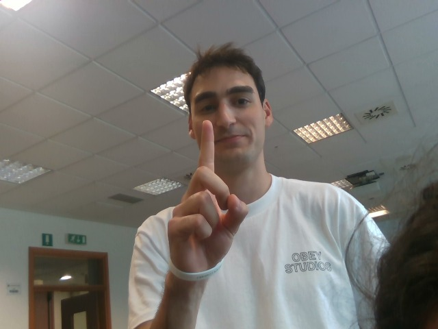

# 🖐️ Touchless Gesture-Controlled Cardiac Model Interaction

This project presents a real-time **gesture recognition interface** to assist cardiac surgeons during operations, enabling the manipulation of a **patient-specific 3D heart model** without any physical contact. The system leverages **depth sensing**, **machine learning**, and **interactive 3D visualization** in Unity for a seamless and sterile interaction experience.

---

## 🧠 System Overview

The system is composed of two integrated pipelines:

- **3D Heart Model Generation**: CT-based anatomical model created with **3D Slicer** and optimized with **MeshLab**.
- **Gesture Recognition**: Real-time classification of hand gestures captured by an **Intel RealSense SR305** camera, processed with **MediaPipe**, and classified using a **Multi-Layer Perceptron (MLP)** neural network.

Once a gesture is recognized, the corresponding interaction command (zoom, rotate, translate) is sent to Unity via **UDP communication**.

---

## ✋ Recognized Gestures

| Gesture        | Function         |
|----------------|------------------|
| Open Hand      | Mode selection / Reset     |
| Index Finger   | Zoom In          |
| Two Fingers    | Rotate Model     |
| Three Fingers  | Translate Model  |

Gestures were recorded from 7 volunteer subjects. The dataset contains **280 RGB-D samples**, and the extracted hand landmarks were augmented with transformations (flipping, rotation, scaling, translation) to improve model generalization.

---

## 🗂️ Sample Dataset and Model Visuals

Below are examples from the RGB-D dataset and the 3D heart mesh:

| RGB Frame                            | Depth Map                            |
|-------------------------------------|--------------------------------------|
|  |  |

### 🫀 Processed Heart Mesh

<p>
  
</p>

---

## 🛠️ Setup and Installation

### 1. Clone the Repository

```bash
git clone https://github.com/yourusername/gesture-cardiac-ui.git
cd gesture-cardiac-ui
```

### 2. Create and Activate Environment

We recommend using a virtual environment or conda environment:

<details>
<summary>Using <strong>conda</strong></summary>

```bash
conda create -n gesture-ui python=3.9
conda activate gesture-ui
```

</details>

---

### 3. Install Dependencies

Install all required Python packages:

```bash
pip install -r requirements.txt
```

---

### 4. Configure Unity Python Path

Open the following script in Unity:

```
Myproject/Assets/Scripts/MenuController.cs
```

At **line 60**, replace the hardcoded path with the correct path to your local Python interpreter:

```csharp
string pythonExePath = "C:/Users/yourname/anaconda3/envs/Soluzione_ddd/python.exe";
```

> 🔧 Replace  the path with the actual path to your Python executable.

---

## 📁 Project Structure

The repository includes the following main components:

- `My project/` — Unity project folder for 3D visualization and gesture interaction.
- `with_real_z/` — Python code and datasets using real depth values from the RealSense camera.
- `with_mediapipe_z/` — Alternative version using MediaPipe’s estimated depth (z) values.
- `gesture_recognition_3D.ipynb` — Main notebook to train and evaluate the gesture classifier.
- `requirements.txt` — Python dependencies.
- `segmentation.zip` — Exported 3D heart mesh.

---

## 🚀 How to Run the System

1. **Train the model (optional)**  
   You can train the classifier by running `gesture_recognition_3D.ipynb` in Google Colab or locally.  
   The notebook internally runs `train.py` and supports both the `with_real_z/` and `with_mediapipe_z/` datasets.  
   👉 If you don’t want to train the model, simply use the provided pre-trained model `with_real_z/best_model.h5`.

2. **Launch Unity Scene**  
   Open the Unity project (`My project/`) and press **Play**. Unity will call the Python script via **UDP**.

3. **Make gestures in front of the RealSense camera**  
   The 3D heart model will respond in real time to hand movements for zoom, rotation, and translation.


## 🎥 Final Demo Video

Watch the real-time gesture recognition and 3D heart interaction in action:
<p>
  
</p>


